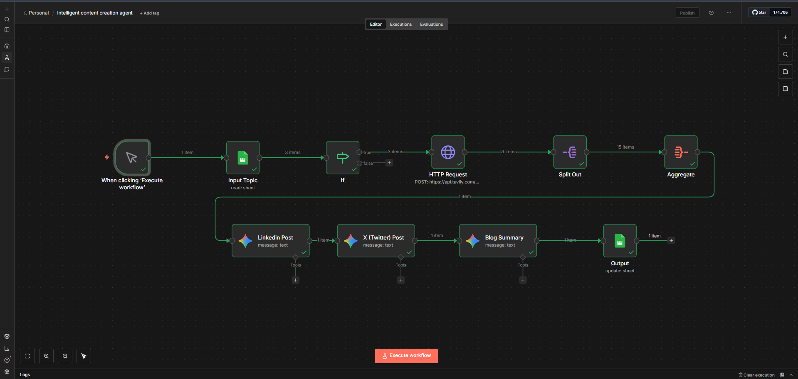

# No-Code AI-Powered Content Creator Agent using n8n (Gemini + Tavily)

## 📌 Project Title

No-Code AI-Powered Content Creator Agent

---

## 🎯 Project Objective

The objective of this project is to design and implement a no-code AI-powered content creator agent using n8n that automates the end-to-end process of identifying trending topics, conducting real-time research, generating platform-specific content (LinkedIn, X, and Blog Summary), and updating outputs automatically in a Google Sheet for organized and scalable content publishing without manual intervention.

---

## 🛠️ Implementation Environment

* Workflow Automation Tool: n8n (Self-hosted on Localhost)
* Frontend Interface: n8n Workflow Editor (localhost)
* AI Model Used: Google Gemini API
* Research API: Tavily Search API
* Database/Input Source: Google Sheets
* Integration Method: HTTP Request Nodes + Google Sheets Node

---

## 🔑 API Keys Used (Not Included for Security)

The following APIs were used in this project:

* Google Gemini API Key (for AI content generation)
* Tavily Search API Key (for real-time web research)
* Google Sheets OAuth Credentials

Note: Actual API keys are not included in the submission for security and privacy reasons.

---

## 📊 Google Sheet Structure (Input Database)

A Google Sheet is used as the input and output database with the following columns:

| Column Name    | Description                             |
| -------------- | --------------------------------------- |
| Topic          | Content topic or keyword                |
| Status         | Processing status (Pending / Completed) |
| LinkedIn_Post  | AI-generated LinkedIn content           |
| X_Post         | AI-generated X (Twitter) content        |
| Blog_Summary   | AI-generated 150–200 word blog summary  |
| Published_Date | Auto-generated timestamp                |

---

## 🔄 Workflow Architecture (n8n)

Schedule Trigger → Google Sheets (Read Topics) → IF Node (Filter Pending Topics) → Tavily API (Real-Time Research via HTTP Request) → Split Out Node → Aggregate Node (Research Summary) → Gemini API (LinkedIn Post Generation) → Gemini API (X Post Generation) → Gemini API (Blog Summary Generation) → Google Sheets (Update Row & Mark as Completed)

---

## ⚙️ Step-by-Step Workflow Logic

1. The workflow is triggered automatically using a Schedule Trigger node.
2. Google Sheets node reads topics with "Pending" status.
3. IF node filters and processes only pending topics.
4. Tavily Search API fetches real-time factual research related to the topic.
5. Split Out and Aggregate nodes structure and summarize research data.
6. Three Gemini API nodes generate platform-specific content:

   * Professional LinkedIn Post
   * Concise X (Twitter) Post
   * Informative Blog Summary (150–200 words)
7. The final Google Sheets Update node maps generated content into relevant columns.
8. The Status column is automatically changed from "Pending" to "Completed".
9. Published_Date is updated with the current timestamp.

---

## 🧪 Sample Input and Generated Output

### Sample Input (Google Sheet)

Topic: Generative AI in Education
Status: Pending

### Generated LinkedIn Post (Sample)

Generative AI is transforming the education sector by enabling personalized learning, automated content creation, and intelligent tutoring systems. Educational institutions are increasingly adopting AI-powered tools to enhance student engagement, streamline administrative tasks, and improve learning outcomes. From AI-driven lesson planning to adaptive assessments, technology is reshaping how knowledge is delivered and consumed in modern classrooms. As AI continues to evolve, it will play a crucial role in bridging learning gaps and making education more accessible and efficient worldwide.
#GenerativeAI #EdTech #FutureOfEducation #AIInnovation #DigitalLearning

### Generated X (Twitter) Post (Sample)

Generative AI is revolutionizing education with personalized learning and smart tutoring systems. The future of learning is AI-driven and adaptive. #AI #EdTech #FutureOfEducation

### Generated Blog Summary (Sample)

Generative AI is rapidly transforming the education landscape by introducing intelligent and personalized learning experiences. AI-powered tools are helping educators create customized lesson plans, automate grading, and provide real-time feedback to students. These technologies enhance student engagement by adapting to individual learning styles and improving knowledge retention. Additionally, AI chatbots and virtual tutors are supporting students outside the classroom, making education more accessible and interactive. Institutions are also leveraging AI for administrative automation and curriculum development. As generative AI continues to advance, it is expected to revolutionize digital learning, reduce educational gaps, and promote inclusive and scalable education systems globally.

---

## ✍️ Prompt Design Strategy (Gemini)

### 1. LinkedIn Post Prompt Design

* Tone: Professional and thought-leadership
* Length: 120–180 words
* Includes hook, insights, and 4–5 relevant hashtags
* Designed for professional audience engagement and credibility

### 2. X (Twitter) Post Prompt Design

* Tone: Concise and engaging
* Character Limit: Under 280 characters
* Includes 2–3 trending hashtags
* Focused on high engagement and readability

### 3. Blog Summary Prompt Design

* Length: 150–200 words
* SEO-friendly and informative
* Fact-based and structured paragraphs
* Easy-to-understand explanation for wider audience

---

## 🔁 Automation & Data Mapping

The workflow uses the Google Sheets “Update Row” operation to:

* Map LinkedIn content → LinkedIn_Post column
* Map X content → X_Post column
* Map Blog summary → Blog_Summary column
* Automatically update Status from “Pending” to “Completed”
* Insert timestamp in Published_Date using {{$now}}

This ensures real-time content organization and automated tracking.

---

## 📸 Workflow Screenshot

A screenshot of the complete n8n workflow is provided:

(The screenshot shows all nodes including Trigger, Google Sheets, Tavily Research, Gemini Content Generation, and Update Node.)

---

## 🚀 Key Features of the AI Content Creator Agent

* Fully automated no-code workflow using n8n (localhost)
* Real-time research using Tavily API
* AI-powered multi-platform content generation using Gemini
* Automatic Google Sheet update and status tracking
* Scalable and production-ready content automation system
* Minimal human intervention required

---

## 📁 Submission Files Included

1. content_creator_agent_workflow.json (Exported n8n Workflow)
2. README.md (Project Documentation)
3. workflow_screenshot.png (Workflow Architecture Screenshot)

---

## 🏁 Conclusion

This project successfully demonstrates the development of a no-code AI-powered content creator agent using self-hosted n8n, Gemini API, and Tavily Search API. The system automates topic research, content generation, and structured publishing workflow, showcasing practical expertise in AI automation, prompt engineering, and scalable digital content creation suitable for real-world marketing, education, and entrepreneurial applications.
